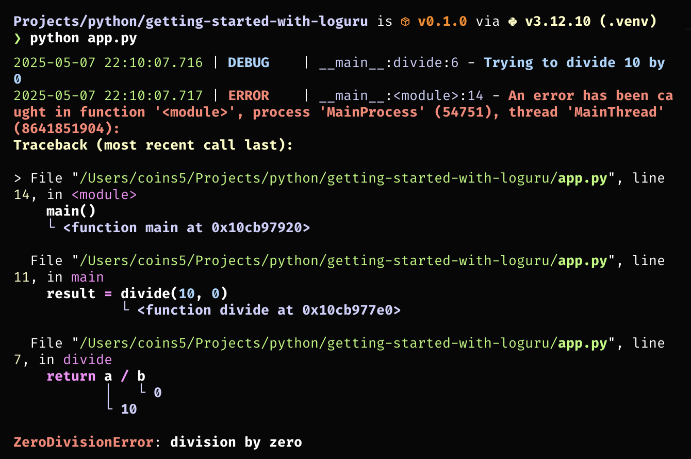

Logging is a must-have in web development and backend systems. It helps you understand what your app is doing, spot bugs, and improve observability. Python comes with a built-in `logging` module, but configuring it can feel like overkill for many common tasks.

That’s where [Loguru](https://github.com/Delgan/loguru) comes in — a simple yet powerful logging library that makes logging in Python way more enjoyable.

## Why use Loguru instead of the built-in logging module?

The standard Python `logging` module is flexible but verbose. Loguru simplifies the most common logging needs:

- No boilerplate configuration.

- Beautiful, colorful logs out of the box.

- Built-in support for log rotation.

- Automatic exception capturing.

## Installation

Just install it with pip:

```sh
pip install loguru
```

## Getting Started

```python
from loguru import logger

logger.info("Hello world from Loguru")
```

Just one line and you’re already logging with timestamps, levels, and colors in your terminal.

## Writing to a File with Rotation

```python
logger.add("logs/app.log", rotation="500 KB", level="DEBUG")
```

This writes logs to app.log and rotates the file once it reaches 500 KB. It also captures logs from the DEBUG level and up.

For more details, see the <a href="https://loguru.readthedocs.io/en/stable/overview.html#easier-file-logging-with-rotation-retention-compression" target="_blank" rel="noopener noreferrer">Loguru documentation</a>.

## Exception Logging

```python
@logger.catch
def buggy_function():
    return 1 / 0

buggy_function()
```

With `@logger.catch`, Loguru will log uncaught exceptions automatically, along with a full stack trace.

## Best Practices

- Use `logger.debug()` for internal dev logs.

- Use `logger.info()` for standard events.

- Use `logger.warning()` for things that might go wrong.

- Use `logger.error()` or `logger.critical()` for serious issues.

- Configure log rotation and retention in production.

- Avoid logging sensitive user data.

## Complete Example

```python
from loguru import logger

logger.add("logs/debug.log", rotation="1 MB", retention="10 days", level="DEBUG")

def divide(a, b):
    logger.debug(f"Trying to divide {a} by {b}")
    return a / b

@logger.catch
def main():
    result = divide(10, 0)
    logger.info(f"Result: {result}")

main()
```



## Final Thoughts

Loguru is a great tool if you're building Python web apps. It's easy to plug into frameworks like Flask, FastAPI, or Sanic (which I use often), and gives you structured, readable logs with minimal effort.
