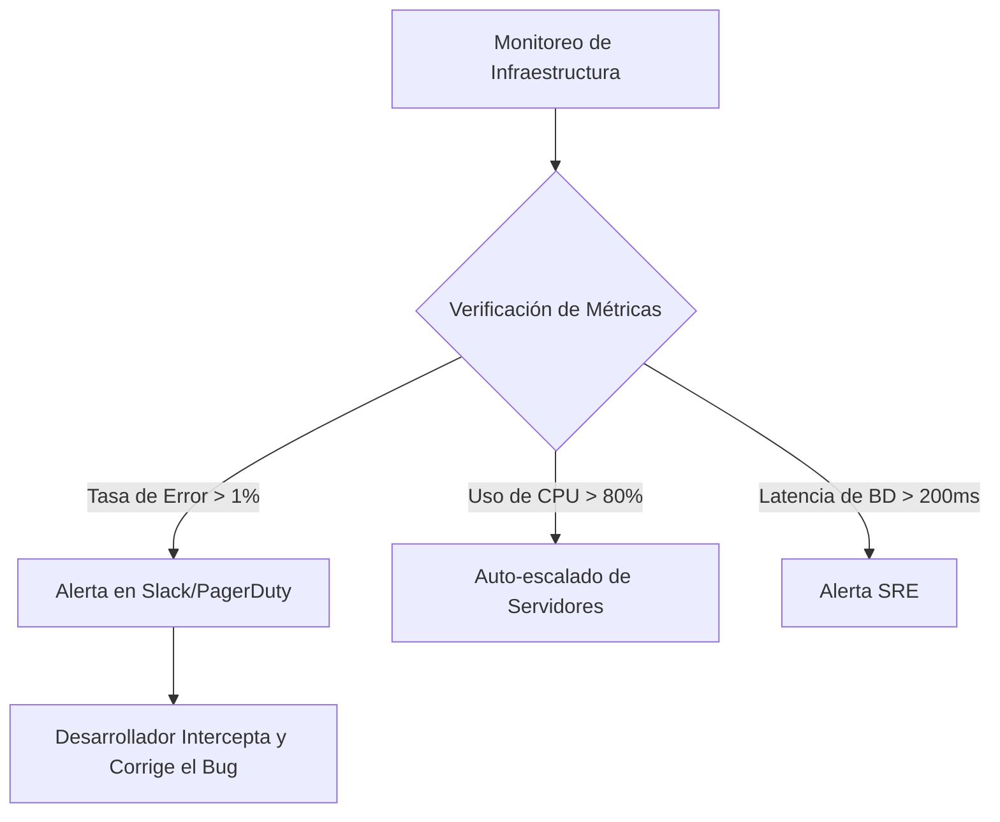

# El Punto Ciego en Producción: El Alto Costo de Operar a Ciegas

Imagina esta escena: lunes a las 9:00 AM. Tu equipo de desarrollo se prepara para la reunión semanal de sincronización cuando el equipo de soporte al cliente enciende las alarmas. Un usuario frustrado ha publicado en redes sociales que la pasarela de pagos lleva caída 48 horas, arrojando errores constantes en la pantalla de pago.

Revisas de inmediato la base de datos y confirmas el desastre: miles de transacciones y carritos de compra fallaron durante todo el fin de semana. Un error silencioso en la integración de la pasarela de pago estaba generando errores 500 (Internal Server Error) de manera totalmente invisible para el equipo.

Este es el peor escenario operativo para cualquier producto digital. Operar a ciegas en producción significa que tus propios usuarios y clientes se convierten en tu equipo de control de calidad (QA). Para cuando alguien se toma el tiempo de reportar el problema o quejarse públicamente, ya has perdido miles de dólares en ventas, dañado la confianza del cliente y afectado la reputación de tu marca.

Para mantener una plataforma de software estable, escalable y competitiva, es obligatorio cambiar la cultura de apagar fuegos reactivamente por una estrategia de monitoreo proactivo. Esta transformación descansa en dos pilares fundamentales: **los logs estructurados** y **la observabilidad de sistemas**.

---

## Pilares de la Observabilidad Moderna: Logs en Texto Plano vs. Logs Estructurados en JSON

La mayoría de los sistemas heredados registran los eventos de la aplicación en archivos de texto plano sin ningún formato específico:

```text
2026-06-19 14:15:32 [ERROR] Pago fallido para el usuario 88291 en Stripe: tarjeta declinada - Request tomo 840ms
```

Aunque una persona puede leer esta línea con relativa facilidad, es extremadamente difícil de procesar para una máquina a gran escala. Si tu aplicación procesa millones de solicitudes al día, buscar y analizar patrones de error a través de archivos de texto con comandos como `grep` es lento, ineficiente y no permite correlacionar datos de forma automatizada.

### La Solución: Logs Estructurados

Los logs estructurados guardan cada evento de la aplicación en un formato de datos estandarizado, generalmente en JSON. Esto hace que las herramientas de telemetría modernas (como AWS CloudWatch, Datadog, ELK Stack o OpenTelemetry) puedan indexar e interpretar cada parámetro al instante.

Así se ve el mismo error de pago formateado como un log estructurado en JSON:

```json
{
  "timestamp": "2026-06-19T14:15:32.482Z",
  "level": "error",
  "message": "Checkout transaction failed",
  "service": "checkout-service",
  "environment": "production",
  "context": {
    "user": {
      "id": "88291",
      "email": "fundador@startup.pe"
    },
    "transaction": {
      "gateway": "stripe",
      "amount": 49900,
      "currency": "usd",
      "error_code": "card_declined"
    },
    "request": {
      "method": "POST",
      "path": "/api/v1/checkout",
      "duration_ms": 840,
      "ip": "198.51.100.42"
    }
  }
}
```

### Por Qué los Logs JSON Resuelven Incidentes en Minutos

Cuando tus logs están estructurados, el sistema de búsqueda se comporta como una base de datos. Si un cliente reporta un fallo, tu equipo técnico no tiene que adivinar qué archivos leer. Pueden consultar la plataforma de monitoreo aplicando filtros exactos:

`service:checkout-service AND level:error AND context.user.id:88291`

En milisegundos, el motor muestra el log preciso con el código de error de la pasarela y la latencia del request. Además, permite estructurar tableros de control (dashboards) en tiempo real para visualizar el porcentaje de transacciones fallidas o el tiempo promedio de respuesta del checkout, convirtiendo datos técnicos en información de negocio.

---

## Alertas Preventivas: Detecta Anomalías Antes que Afecten al Usuario

La observabilidad no solo sirve para analizar errores después de que ocurren; su principal valor es alertarte sobre el comportamiento de tu infraestructura en tiempo real para que actúes de manera preventiva.

### 1. Métricas Clave de Salud del Servidor
* **Tasa de Errores HTTP**: Un incremento repentino en respuestas 5xx indica una caída del servidor o un fallo en un servicio externo de terceros.
* **Pool de Conexiones a la Base de Datos**: Quedarse sin conexiones libres provoca que las peticiones se acumulen en cola, generando caídas por timeout.
* **Consumo de Memoria y CPU**: Fugas de memoria u operaciones no optimizadas consumirán los recursos del servidor hasta que el sistema operativo mate el proceso.
* **Latencia del API (p95 / p99)**: Mide el tiempo de respuesta del 95% o 99% de los usuarios. Si esta métrica se dispara, tu plataforma se volverá insoportablemente lenta para tus clientes más activos.

### 2. Configuración de Alertas Proactivas
En lugar de esperar a que la aplicación deje de funcionar, la ingeniería de confiabilidad (SRE) establece umbrales de alerta automatizados:



Al dispararse una alerta, el equipo recibe una notificación instantánea en Slack o PagerDuty con el enlace directo a los logs estructurados del incidente. Esto les permite corregir la consulta lenta, liberar memoria o solucionar la caída del proveedor *antes* de que tus usuarios lo noten.

---

## Retorno de Inversión (ROI): Por Qué la Telemetría es una Decisión Comercial

Para los directores de tecnología (CTOs) y fundadores de startups, la observabilidad no es un capricho técnico, es una inversión con un retorno financiero directo:

1. **Reducción Drástica del MTTR (Tiempo Medio de Resolución)**: En un incidente, los desarrolladores pasan el 90% del tiempo buscando el error y solo el 10% arreglándolo. Los logs estructurados invierten esta proporción, reduciendo el tiempo de diagnóstico de días a minutos.
2. **Protección de la Conversión**: Detectar un fallo en la pasarela de pagos en 5 minutos en lugar de 48 horas salva miles de dólares en ventas perdidas y carritos abandonados.
3. **Fidelización y Retención de Clientes**: Los usuarios no toleran la inestabilidad. Si tu plataforma es lenta o inestable, migrarán silenciosamente a la competencia. Las alertas tempranas protegen la experiencia del cliente.
4. **Optimización de Costos Cloud**: Las métricas de consumo real te permiten saber exactamente cuándo puedes reducir el tamaño de tus servidores en AWS o Google Cloud sin comprometer el rendimiento, recortando gastos innecesarios de infraestructura.

---

## Estabilidad y Control con el Factor Senior + IA

Configurar una pila de telemetría completa —desde formatear serializadores de logs, instrumentar agentes APM, hasta estructurar paneles de control y alertas— suele requerir semanas de trabajo especializado.

Mediante el **Factor Senior + IA**, aceleramos este proceso drásticamente. Empleamos agentes de Inteligencia Artificial para programar middleware de registro estructurado, mapear esquemas JSON y estructurar la configuración base de las alertas al triple de velocidad.

Posteriormente, aplicamos criterio senior de arquitectura de software para asegurar que ningún dato sensible de los usuarios (PII como contraseñas, tokens o números de tarjeta) se filtre en los logs, evitar la "fatiga de alertas" (que causa que el equipo ignore notificaciones críticas) y priorizar los flujos clave del negocio. El resultado es un sistema de monitoreo robusto, de nivel enterprise, listo en tiempo récord.

---

## Mantén tu Plataforma Estable y Protege tu Conversión

No sigas operando a ciegas. Logra visibilidad total sobre tu backend, bases de datos e integraciones críticas, e intercepta los problemas en producción mucho antes de que tus usuarios se enteren.

### ¿Listo para escalar tu producto?
* **Agenda una Reunión**: [Book a Call](https://calendar.app.google/AbnPNcKVJyDnaU9z5) para conversar sobre la observabilidad de tu aplicación, monitoreo de producción y arquitectura de software en una llamada de descubrimiento de 15 minutos.
* **Cotiza por WhatsApp**: Escríbeme directamente por [WhatsApp](https://wa.me/51922913739?text=Hola%20Marlon%2C%20quisiera%20conversar%20sobre%20c%C3%B3mo%20implementar%20observabilidad%20y%20logs%20estructurados%20en%20mi%20plataforma.) para evaluar la estabilidad y telemetría de tu sistema.
