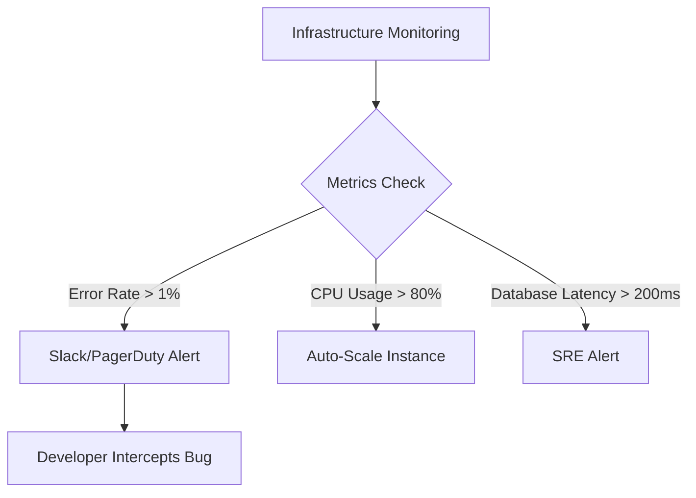

# The Blind Spot: The Operational and Financial Toll of Silent Production Failures

Imagine this scenario: It is 9:00 AM on a Monday. Your development team is getting ready for their weekly sync, when the customer success team raises a red flag. A frustrated user has posted on social media that the checkout page has been throwing errors for the past 48 hours. 

You scramble to check the database. Sure enough, thousands of cart transactions have failed over the weekend. A silent bug in a payment gateway integration had been throwing 500 Internal Server Errors, completely undetected.

This is the ultimate operational nightmare for any software product. Being blind in production means your users are acting as your QA team. By the time someone takes the effort to submit a support ticket or complain publicly, you have already lost revenue, damaged customer trust, and hurt your brand's reputation.

To maintain a highly stable, competitive application, you must shift from reactive firefighting to proactive monitoring. This transformation requires two core pillars: **structured logging** and **system observability**.

---

## The Pillars of Modern Observability: Plain Text vs. Structured JSON Logs

Most legacy systems log application events as raw, unstructured text. They output lines like this:

```text
2026-06-19 14:15:32 [ERROR] User 88291 checkout failed on Stripe: card was declined - Request took 840ms
```

While this line is readable by humans, it is a nightmare to query at scale. If you are dealing with millions of requests per day, searching through text files using `grep` is slow, computationally expensive, and extremely difficult to aggregate. 

### Enter Structured Logging

Structured logging formats log events as structured data, typically in JSON. This makes them readable by machines and instantly indexable by modern telemetry platforms like AWS CloudWatch, Datadog, ELK Stack, or OpenTelemetry.

Here is the exact same event represented as a structured JSON log:

```json
{
  "timestamp": "2026-06-19T14:15:32.482Z",
  "level": "error",
  "message": "Checkout transaction failed",
  "service": "checkout-service",
  "environment": "production",
  "context": {
    "user": {
      "id": "88291",
      "email": "founder@startup.io"
    },
    "transaction": {
      "gateway": "stripe",
      "amount": 49900,
      "currency": "usd",
      "error_code": "card_declined"
    },
    "request": {
      "method": "POST",
      "path": "/api/v1/checkout",
      "duration_ms": 840,
      "ip": "198.51.100.42"
    }
  }
}
```

### Why JSON Logs Resolve Incidents in Minutes

When logs are structured, database-like querying is unlocked. If a customer reports a failure, your engineers do not need to guess which logs to read. They can query your monitoring platform using precise filters:

`service:checkout-service AND level:error AND context.user.id:88291`

Within milliseconds, the exact log event, complete with the Stripe decline error and request duration, is displayed. Furthermore, you can build live dashboards tracking metrics such as *the percentage of failed transactions* or *average checkout latency*, turning raw logs into real-time business intelligence.

---

## Proactive Alerts: Intercepting Anomalies Before Users Notice

Observability is not just about logging errors; it is about tracking the vital signs of your infrastructure. To stop bugs before they reach your users, your architecture must monitor key performance indicators (KPIs) and alert you when they deviate from normal baselines.

### 1. Key System Health Metrics
* **HTTP Error Rates**: A sudden spike in 5xx Status Errors indicates a server crash or failing external API.
* **Database Connection Pool**: Running out of database connections causes requests to queue up, leading to timeout errors.
* **Memory & CPU Utilization**: Gradual memory leaks or unoptimized loops will steadily consume server capacity until the operating system terminates the process.
* **API Latency (p95 / p99)**: The 95th or 99th percentile response time. If p99 latency spikes, it means your most active users are experiencing a painfully slow app.

### 2. Setting Up Proactive Quality Gates
Instead of waiting for a total crash, SRE practices dictate setting up automated alerting thresholds:



When an alert triggers, your team receives a notification in Slack or PagerDuty with links to the relevant structured logs. They can identify and fix the memory leak, database lock, or integration error *before* the first user complaint ever arrives.

---

## The Business Value: Why Observability is a Profit Center

For tech founders and executives, observability might sound like an engineering-only topic. In reality, it has a massive impact on the company's bottom line:

1. **Drastically Lower MTTR (Mean Time to Resolution)**: When a production issue occurs, developers spend 90% of their time finding the bug and 10% fixing it. Structured logging flips this ratio, cutting debugging time from hours or days to mere minutes.
2. **Minimized Revenue Leakage**: Catching a payment gateway failure in five minutes instead of two days saves thousands of dollars in lost checkouts.
3. **High User Retention (Churn Prevention)**: Users expect application reliability. If your app is slow or error-prone, they will quietly switch to a competitor. Proactive alerting keeps availability high and users happy.
4. **Data-Backed Resource Planning**: System metrics tell you exactly when to scale up your servers and when you can scale down, preventing you from overpaying on your monthly cloud bill.

---

## Scaling Your Stability with the Senior + AI Factor

Implementing a comprehensive telemetry stack—configuring log formatters, setting up APM agents, and designing alert dashboards—requires experience and precision. 

By leveraging the **Senior + AI Factor**, we drastically accelerate this setup. We utilize advanced AI agents to rapidly write logging middlewares, generate JSON schemas, and draft standard alert configurations. 

Then, we apply senior SRE criteria to ensure that sensitive user data (PII like passwords or credit card numbers) is automatically scrubbed from logs, alerts are tuned to avoid alert fatigue (which leads to developers ignoring them), and key integration paths are heavily monitored. The result is a rock-solid, production-ready observability system built in a third of the traditional time.

---

## Keep Your Platform Stable and Your Customers Happy

Don't operate in the dark. Bring full visibility to your backend, database, and third-party integrations, and resolve production incidents before your users even realize something went wrong.

### Ready to scale your product?
* **Schedule a Call**: [Book a Call](https://calendar.app.google/AbnPNcKVJyDnaU9z5) to discuss your application observability, production monitoring, and software scaling architecture in a 15-minute discovery session.
* **Get a Direct Quote**: Start a direct conversation on [WhatsApp](https://wa.me/51922913739?text=Hello%20Marlon%2C%20I%20would%20like%20to%20discuss%20production%20observability%20and%20structured%20logging%20for%20my%20application.) to discuss scope, timelines, and custom monitoring options.
